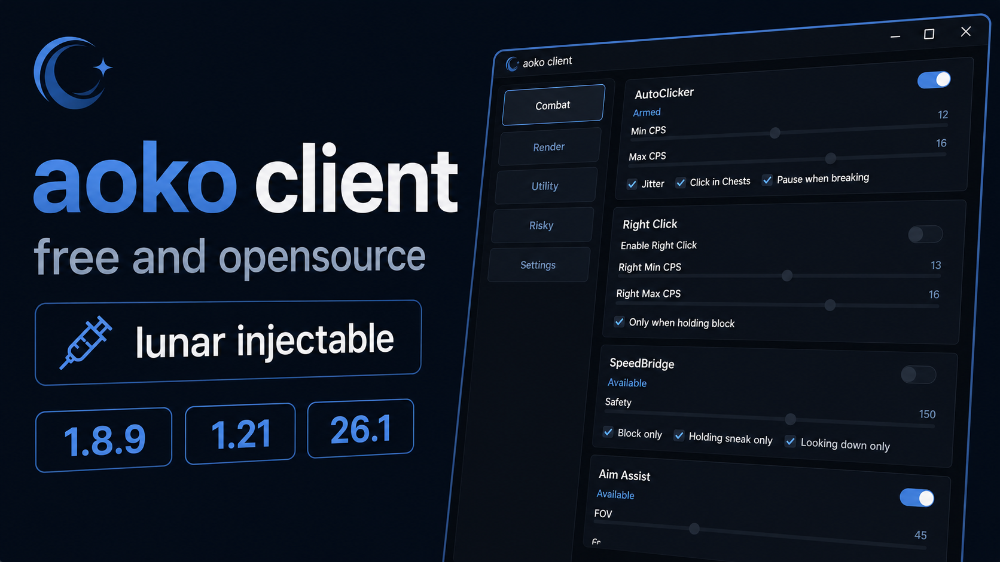

# aoko client

aoko client is a Windows utility client for Lunar Client.

# Showcase
[](https://www.youtube.com/watch?v=eR7QKAWw8D4)

## Documentation

- Full docs (landing page + per-module guides): https://naczo5.github.io/aoko-client/
- Module reference index: https://naczo5.github.io/aoko-client/getting-started/
- Docs source lives in [`website/`](website/) (Astro + Starlight); see [Website](#website) below.

## Current status

- Supported versions: **26.2**, **26.1**, **1.21.x**, and **1.8.9**.
- All supported versions are used through the external GUI in `Aoko/`.
- On **Lunar 26.2** the game can present via the new **Vulkan** renderer; `bridge_261.dll` auto-detects OpenGL vs Vulkan at runtime and renders the overlay natively on either (kill-switch: set `AOKO_BRIDGE261_VULKAN=0` to force-disable the Vulkan path).

## Features (current)

- Autoclicker (left/right, CPS range, jitter, block-only options)
- Aim Assist
- Triggerbot
- SpeedBridge 
- Reach and Velocity controls
- AutoTotem (inventory only and anarchy mode)
- AntiDebuff (hides Blindness/Nausea client-side, plus Darkness on 1.21/26.1)
- Chest Stealer (external cursor-based)
- GTB Helper
- Discord Rich Presence
- Nametags, Closest Player panel, Chest ESP
- Per-module keybinds (all unbound by default)
- Profiles saved in `%AppData%\Aoko\profiles\`
- GUI customization (slate palettes, module list style, show logo)

## Screenshots


## Requirements

- Windows 10/11 x64
- Lunar Client
- .NET 8 SDK (build only)
- MinGW-w64 + JDK 17 headers (native build only)

## Quick start

1. Start Lunar Client.
2. Run `Aoko.exe`.
3. Click **Inject**.
4. Use the external GUI.

_It is generally recommended to inject while in a server/world, to ensure are modules initialize correctly_

## Build

Run from repository root unless noted.

### Native bridge DLLs

- Build both: `build_dll.bat`
- Build 26.1 only: `McInjector\build_261.bat`
- Build 1.8.9 only: `McInjector\build.bat`

### Loader (C#)

- Debug build: `dotnet build Aoko\Aoko.csproj`
- Release build: `dotnet build -c Release Aoko\Aoko.csproj`
- Run: `dotnet run --project Aoko\Aoko.csproj`
- Publish release exe: `build_exe.bat`

### Full release pipeline

- `build_release.bat`

## Tests

- Run C# tests: `dotnet test Aoko.Tests\Aoko.Tests.csproj`
- Run native harness tests: `McInjector\run_tests.bat`

## Notes on versions

- `bridge_261.dll` is the modern bridge used for both 26.1 and 1.21 injection.
- `bridge.dll` is used for 1.8.9 injection, sometimes reffered to as 'legacy'.
## Project structure

```text
aoko/
|- Aoko/              # WPF loader + external GUI (.NET 8)
|  |- Core/                    # Clicker, hooks, profile, TCP client
|  |- MainWindow.xaml(.cs)     # Main UI
|  |- bridge.dll               # 1.8.9 bridge (legacy)
|  `- bridge_261.dll           # 26.1 bridge
|- McInjector/
|  |- build.bat                # 1.8.9 bridge build (legacy)
|  |- build_261.bat            # 26.1 bridge build
|  `- src/main/cpp/            # Native bridge sources
|- website/                    # Docs site (Astro + Starlight) + landing page in public/
`- README.md
```

## Website

The documentation site and marketing landing page live in [`website/`](website/) as an
[Astro](https://astro.build/) + [Starlight](https://starlight.astro.build/) project:

- `website/public/` — the hand-rolled landing page (`index.html`, `style.css`, `main.js`,
  favicons, `screenshots/`), served at the site root.
- `website/src/content/docs/` — per-module documentation in Markdown (the sidebar/categories
  mirror the in-GUI module layout).

### Local development

```text
cd website
npm install
npm run dev      # local preview at http://localhost:4321/aoko-client/
npm run build    # static output in website/dist/
```

### Deployment

Pushing changes under `website/**` to `main` or `dev` triggers
[`.github/workflows/docs.yml`](.github/workflows/docs.yml), which builds the site with the
official Astro action and publishes it to GitHub Pages.

> One-time setup: in the repository **Settings → Pages**, set the **Source** to
> **GitHub Actions** (previously this repo served the static `docs/` folder from a branch).

## Architecture

- The C# loader injects the bridge DLL into Lunar and manages settings/UI.
- Bridge and loader communicate over TCP (`25590`).
- Bridge renders overlays through OpenGL/ImGui and reads game state via JNI.
- Input actions are usually sent through Win32 `SendInput`.
- Bridge capabilities gate version-specific modules and controls.

## Safety constraint used by this project

- Bridge-side logic reads game state and may perform controlled, module-scoped JNI/game interactions for features that require them.
- Do not add raw packet spam or unrelated in-game combat method calls.

## Contributions

Pull requests are welcome for bug fixes and new modules.

- When reporting a bug you can use the issues tab, attach the logs if possible, they are located in the client's directory.
- New modules should be tested on major/actest servers.
- It should be mentioned if they do not bypass and what is
therefore their usecase (like private or anarchy servers).

## TODO

- [ ] make antidebuff work correctly on modern versions


## Support

ETH - `0x04166c3bec4e2e28799AdFa0b336b0159d90c699`