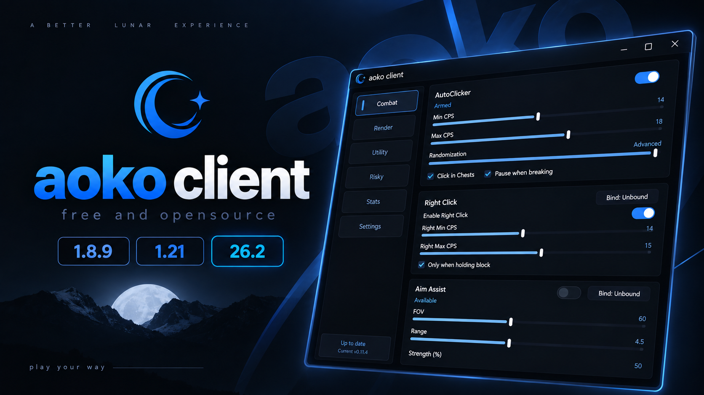
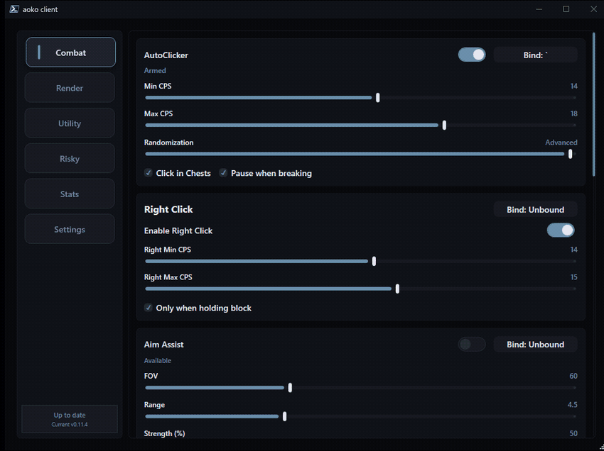
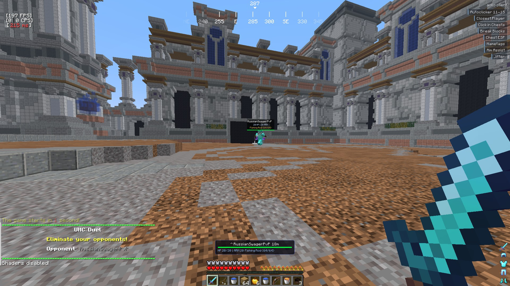

# aoko client

[](https://github.com/naczo5/aoko-client/releases/latest)
[](https://github.com/naczo5/aoko-client/releases)
[](https://github.com/naczo5/aoko-client/stargazers)
[](https://github.com/naczo5/aoko-client/blob/main/LICENSE)

aoko client is an open-source Windows utility client and external overlay for Lunar Client and standalone Minecraft instances.

# Showcase
[](https://www.youtube.com/watch?v=eR7QKAWw8D4)

## Current status

- Supported versions: **26.2**, **26.1**, **1.21.x**, and **1.8.9**.
- Supported environments: **Lunar Client** as well as **standalone Minecraft instances** (1.8.9 on Forge, modern versions on Fabric).
- On **modern 26.2** the game can present via OpenGL or the new **Vulkan** renderer; `bridge_261.dll` auto-detects OpenGL vs Vulkan at runtime and renders the overlay natively on either (kill-switch: set `AOKO_BRIDGE261_VULKAN=0` to force-disable the Vulkan path).

## Features (current)

- Kill Aura (configurable CPS, attack/swing ranges, FOV, auto-block, smooth rotations)
- Autoclicker (left/right, CPS range, jitter, block-only options)
- Aim Assist
- Triggerbot
- SpeedBridge
- Reach and Velocity controls
- AutoTotem (inventory-only and anarchy modes)
- Auto Rod (auto/forced hotbar selection, one-use action bind, exact slot restoration)
- AutoTool (weapon swap on hover, optimal tool selection, Bedwars mode)
- AntiDebuff (hides Blindness/Nausea client-side, plus Darkness on 1.21/26.1/26.2)
- Nick Hider (JVMTI-based local name spoofing)
- Hit Delay Fix (removes 1.8.9 attack cooldown delays)
- Chest Stealer (external cursor-based with menu check)
- GTB Helper & Pixel Party Assist
- Discord Rich Presence
- Nametags, Closest Player panel, Fight Status, Chest ESP, Block ESP, BedPlates
- In-Game ClickGUI (Dear ImGui midnight blue glass menu with category tabs, real-time search, animated collapsible module cards, pill toggles, and inline keybind configuration)
- GUI Modes (Hybrid External WPF + In-Game ClickGUI, External Only, In-Game Only)
- In-game HUD Editor & module list styling
- Per-module keybinds (all unbound by default, configurable in WPF & ClickGUI)
- Profiles saved in `%AppData%\Aoko\profiles\`
- GUI customization (slate palettes, module list style, show logo)

## Screenshots





## Requirements

- Windows 10/11 x64
- Lunar Client
- .NET 8 SDK (build only)
- MinGW-w64 + JDK 17 headers (native build only)

## Quick start

1. Start Lunar Client.
2. Run `Aoko.exe`.
3. Click **Inject**.
4. Use the external GUI.

_Inject while in a server or world so modules initialize cleanly._

## Install and update with Scoop

Aoko is distributed through this repository's Scoop bucket. After installing
[Scoop](https://scoop.sh/), add the bucket and install Aoko:

```powershell
scoop bucket add aoko https://github.com/naczo5/aoko-client
scoop install aoko
```

Close Aoko before updating, then run:

```powershell
scoop update aoko
```

To remove it, run `scoop uninstall aoko`. Scoop updates only the application
files; your profiles and custom palettes stay in `%AppData%\Aoko`.

## Build

Run from repository root unless noted.

### Native bridge DLLs

- Build both: `build_dll.bat`
- Build 26.1 only: `McInjector\build_261.bat`
- Build 1.8.9 only: `McInjector\build.bat`

### Loader (C#)

- Debug build: `dotnet build Aoko\Aoko.csproj`
- Release build: `dotnet build -c Release Aoko\Aoko.csproj`
- Run: `dotnet run --project Aoko\Aoko.csproj`
- Publish release exe: `build_exe.bat`

### Full release pipeline

- `build_release.bat`

## Tests

- Run C# tests: `dotnet test Aoko.Tests\Aoko.Tests.csproj`
- Run native harness tests: `McInjector\run_tests.bat`

## Notes on versions

- `bridge_261.dll` is the modern bridge used for both 26.1 and 1.21 injection.
- `bridge.dll` is used for 1.8.9 injection, sometimes referred to as 'legacy'.
## Project structure

```text
aoko/
|- Aoko/              # WPF loader + external GUI (.NET 8)
|  |- Core/                    # Clicker, hooks, profile, TCP client
|  |- MainWindow.xaml(.cs)     # Main UI
|  |- bridge.dll               # 1.8.9 bridge (legacy)
|  `- bridge_261.dll           # 26.1 bridge
|- McInjector/
|  |- build.bat                # 1.8.9 bridge build (legacy)
|  |- build_261.bat            # 26.1 bridge build
|  `- src/main/cpp/            # Native bridge sources
|- website/                    # Docs site (Astro + Starlight) + landing page in public/
`- README.md
```

## Architecture

- The C# loader injects the bridge DLL into Lunar and manages settings/UI.
- Bridge and loader communicate over TCP (`25590`).
- Bridge renders overlays through OpenGL/ImGui and reads game state via JNI.
- Input actions are usually sent through Win32 `SendInput`.
- Bridge capabilities gate version-specific modules and controls.

## Contributions

Pull requests are welcome for bug fixes and new modules.

- When reporting bugs on the Issues tab, attach log files from the client directory.
- New modules should be tested on major/actest servers.
- Note whether new modules bypass anticheats, or if they are intended for private/anarchy servers.

## Support

ETH - `0x04166c3bec4e2e28799AdFa0b336b0159d90c699`
